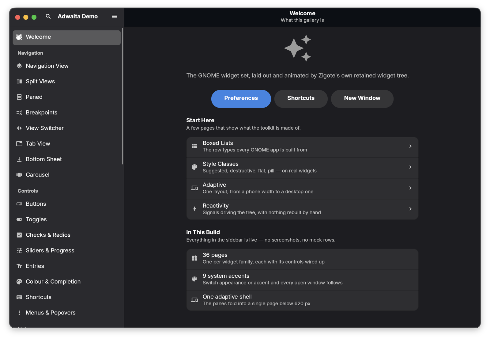
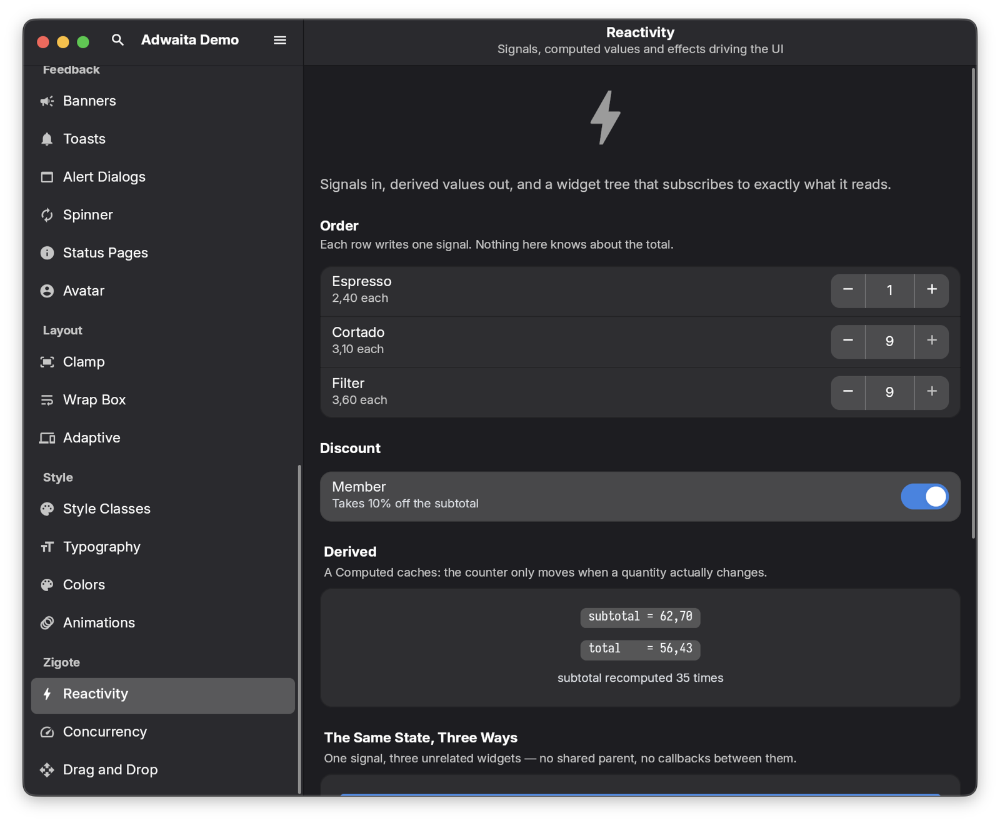

<div align="center">

# Zigote

**A UI framework for .NET that brings its own renderer.**

Write native desktop and mobile apps in C# or F#. Widgets, layout, text and paint are the
framework's own code, drawn on the GPU by a Zig + wgpu backend — no web view, no OS toolkit
underneath, no XAML.

[](https://dotnet.microsoft.com/)
[](https://ziglang.org/)
[](#platforms)
[](LICENSE)

[Quick start](#quick-start) · [The two ideas](#the-two-ideas) · [What you get](#what-you-get) ·
[Design systems](#design-systems) · [Games & 3D](#games-3d-and-the-editor) ·
[Docs](#documentation)



<sub>An app built with `Zigote.UI.Adwaita`, one of the design systems that ship on top of the
framework. Same C# runs on macOS, Linux and Windows.</sub>

</div>

---

## What Zigote is

A **retained-mode widget framework**. You describe a tree of widget objects once; the framework keeps
that tree alive and mutates it. Layout, painting, input, focus, animation, navigation and text
editing are all implemented here, in `Zigote.UI`, on top of a small C ABI into a native library.

Nothing is delegated to the platform's toolkit. Text is shaped with HarfBuzz and rasterised with
FreeType inside the engine — down to synthetic bold and oblique for faces that lack the style, and
the platform's color emoji — so a window looks the same everywhere; wgpu picks Metal, Vulkan or
D3D12 per OS without the code above knowing.

The repository also contains a **3D engine, a gameplay layer and a visual editor**. Those are
separate systems that sit next to the UI framework, not under it — an app never pays for them.
See [Games, 3D and the editor](#games-3d-and-the-editor).

---

## Quick start

**You need:** the [.NET 10 SDK](https://dotnet.microsoft.com/) (`global.json` pins 10.0.110),
[Zig 0.16.0](https://ziglang.org/download/) on `PATH`, and `git`.

```sh
git clone --recurse-submodules https://github.com/ZigoteProjectOrg/Zigote.git
cd Zigote
dotnet build Zigote.sln          # builds the native engine, then the whole solution
```

Then start an app of your own — `zigote create` writes the project, the entry point and the
`.gitignore`, wired to this checkout:

```sh
dotnet run --project Zigote.Cli -- create MyApp
cd MyApp && dotnet run --project MyApp
```

Or run something that already exists:

```sh
dotnet run --project Zigote.UI.HelloWorld        # smallest complete app — start here
dotnet run --project Zigote.UI.Gallery           # the toolkit end to end: charts, i18n, navigation
dotnet run --project Zigote.UI.Adwaita.Gallery   # the GNOME design system, 37 pages
dotnet run --project Zigote.UI.FSharp.Gallery    # the same framework from F#
```

Press <kbd>Shift</kbd>+<kbd>D</kbd> in any of them for the
[DevTools overlay](Zigote.UI.DevTools/README.md) — widget inspector, frame timeline, live reactive
counters.

### The whole app

```csharp
using Zigote.Core.State;          // Signal<T>, Computed, Effect
using Zigote.UI.Host;             // ZigoteApp
using Zigote.UI.Theme;            // ThemeData, Spacing
using Zigote.UI.Widgets;          // Widget, ComposedWidget, Watch, BuildContext
using Zigote.UI.Widgets.Controls; // Label, Button
using Zigote.UI.Widgets.Layout;   // Column, Center

new ZigoteApp { Title = "Counter", Theme = ThemeData.Dark, Home = new CounterPage() }.Run();

sealed class CounterPage : ComposedWidget
{
    private readonly Signal<int> _count = new(0);

    protected override Widget Build(BuildContext context) => new Center(
        new Column(
            mainAxisSize: MainAxisSize.Min,
            spacing: Spacing.Md,
            children:
            [
                new Watch(() => new Label($"Count: {_count.Value}")),
                new Button("Increment", () => _count.Value++),
            ]));
}
```

`ZigoteApp` boots the engine, opens the window, installs the theme and wraps `Home` in a root
`Navigator`, so `context.Push` / `context.Pop` work anywhere in the tree.

---

## The two ideas

Everything else follows from these two, and nearly every newcomer bug traces back to the first.

### 1. `Build` runs once

The tree that `Build` returns is **kept**. Hover, focus, caret position, scroll offset and in-flight
animations live on the widget instances, so there is no per-frame diff and nothing to reconcile.
A widget's fields *are* its state.

```csharp
button.Label = $"Clicked {count}×";              // good — same instance, keeps hover and press
app.Root = new Button($"Clicked {count}×", …);   // bad  — a new widget loses all of it
```

When you change something, tell the framework how much it cost:
`MarkNeedsPaint()` < `MarkNeedsLayout()` < `MarkNeedsBuild()`. Only the last re-runs `Build`.

### 2. Signals, not rebuilds

`Zigote.Core.State` holds four primitives that work with no UI in sight, plus one widget that
connects them to the tree.

```csharp
var query   = new Signal<string>("");
var results = Computed.From(() => Index.Search(query.Value));   // lazy, cached, auto-tracked
using var io = new Effect(() => Save(results.Value),            // re-runs when a source changes…
                          EffectAffinity.Deferred);             // …on the frame loop, not the writer

Reactive.Batch(() => { name.Value = n; age.Value = a; });       // one pass, one layout, one redraw

new Watch(() => new Label($"{results.Value.Count} hits"));      // the bridge into the widget tree
```

| Primitive | Answers | Package |
| --- | --- | --- |
| `Signal<T>` | What is true now? | `Zigote.Core` |
| `Computed<T>` | What is derived from it? (glitch-free, leak-free while unobserved) | `Zigote.Core` |
| `Effect` | What imperative work reacts to it? (`Inline`, or `Deferred` to the frame loop) | `Zigote.Core` |
| `Trigger` / `LinkedSignal<T>` | Valueless events; derived-but-locally-overridable values | `Zigote.Core` |
| `Watch` | How does a signal reach the widget tree? | `Zigote.UI` |
| `Bloc<TEvent, TState>` | How does the app behave? Events in, ordered; state out as signals | `Zigote.Bloc` |

`Watch` re-runs **one subtree** — the one that read the signal — not a page. Signals are not
thread-affine: a network, audio or timer thread may write freely, and what you declare is where the
*reaction body* runs.



Rebuild counts are measurable rather than claimed — `ui.watch_rebuilds`, `reactive.writes` and
`reactive.runs` are live counters in DevTools, and `Reactive.TrackReactions` names the hottest
reaction body.

`Zigote.Core.Threading.Background` adds the frame-aware half: results delivered against a per-frame
budget, `Slice` for work spread over frames, `Latest` for debounced latest-wins — with failures
reported instead of swallowed.

<br clear="right">

---

## What you get

`Zigote.UI` is the kernel. It depends on nothing above the GPU, which is also why the whole widget
layer is headlessly testable — build a tree, lay it out, dispatch synthetic input, assert on the
emitted paint commands, no window required.

| Area | What is in it |
| --- | --- |
| **Layout** | `Column`, `Row`, `Stack`, `Wrap`, `Expanded`, `Padding`, `Align`, `SizedBox`, `ScrollView`, virtualized `ListView`/`GridView`, `InteractiveViewer` (pan / pinch-zoom) |
| **Controls** | `Label`, `Button`, `Card`, `Dialog`, `Snackbar`, `Tooltip`, `ContextMenu`, `Popover`, `RichText`, `SelectableText`, `Pressable` |
| **Text & input** | Engine-backed shaping and measurement, selection, undo, and the IME seam (`ITextInputClient`). The editable `TextField` itself ships in `Zigote.UI.Material` — see below. |
| **Liquid Glass** | `LiquidGlass` surfaces over media — the shader anchors the backdrop per pixel, the theme picks the glass family — plus `LiquidGlassLayer`, blend groups and `GlassGlow` |
| **Animation** | Explicit transitions, implicit `AnimatedOpacity`/`AnimatedAlign`/`AnimatedSwitcher`, and a fluent API: `widget.Animate().Fade(500.ms).Scale(delay: 500.ms)` |
| **Navigation** | Navigator 2.0 — imperative `Push`/`Pop`, named routes, or a declarative page stack driven by a signal |
| **Windowing** | Multiple OS windows, overlays, drag & drop (in-app and OS files), one `AppMenu` model → native `NSMenu` on macOS and an in-window menu bar elsewhere |
| **Theming** | `ThemeData` for appearance-dependent colour; `Spacing`, `Typography`, `Radii`, `Elevation` token scales for the rest |
| **Focus & a11y** | Tab / arrow / Esc traversal with modal traps, and a platform-neutral semantics tree |
| **Hot reload** | Edit a `Build()` under `dotnet watch` and the running UI updates — instances and fields survive |

The form controls live one package up, in **[`Zigote.UI.Material`](Zigote.UI.Material/README.md)**,
and the kernel deliberately does not duplicate them: `TextField` (single- and multi-line with full
IME composition), `Checkbox`, `Radio<T>`, `Switch`, `Slider`, `Dropdown<T>`, `TabBar`, `Chip`,
`SplitPane`, `TreeView<T>`, `ReorderableList`, `ColorPicker`, `CurveEditor`, `CodeEditor`.

Full detail: [`Zigote.UI/README.md`](Zigote.UI/README.md).

Around the kernel: [`Zigote.UI.Charts`](Zigote.UI.Charts/README.md) (declarative charting),
[`Zigote.UI.Localizations`](Zigote.UI.Localizations/README.md) (locales, plural rules, typed messages
from ARB), [`Zigote.UI.DevTools`](Zigote.UI.DevTools/README.md),
[`Zigote.UI.BottomSheet`](Zigote.UI.BottomSheet/README.md),
[`Zigote.UI.Functional`](Zigote.UI.Functional/README.md) (a component as a plain function, via one
widget: `View`), `Zigote.UI.FSharp` ([F# ergonomics](Zigote.UI.FSharp/README.md):
`signal` / `computed` / `watch`), and `Zigote.Modules.UI.CodeEditor`.

---

## Design systems

A design system in Zigote is a **layer over the kernel, not a fork**. Both of the ones that ship
compose the same primitives, so they share theming, focus, semantics and hot reload — and mixing
them in a single app is supported. They are not quite peers, though: `Zigote.UI.Material` doubles
as the framework's control library, and Adwaita builds on it — `AdwEntry` is Material's `TextField`
under Adwaita styling.

| | |
| --- | --- |
| **[`Zigote.UI.Adwaita`](Zigote.UI.Adwaita/README.md)** | The GNOME **Adwaita** design language, tracking libadwaita 1.10 (GNOME 51): 100 `Adw*` types, both appearances, the nine accents, boxed-list rows, adaptive navigation, and client-side decorations the app draws itself — down to traffic lights that reveal their glyphs on hover, as macOS does. Not a GTK binding — nothing links against GTK, GLib or libadwaita, so an Adwaita app runs unchanged on macOS and Windows. |
| **[`Zigote.UI.Material`](Zigote.UI.Material/README.md)** | The **Material** vocabulary with the Flutter names and named-argument constructors — `Scaffold`, `AppBar`, `ListTile`, `ElevatedButton`, `FloatingActionButton`. A Material tree ports across almost line for line. |

<table>
<tr>
<td width="50%"></td>
<td width="50%"></td>
</tr>
<tr>
<td><sub><b>One button, a whole vocabulary.</b> Style classes and shapes — suggested, destructive, flat, pill, circular, compact, split.</sub></td>
<td><sub><b>Adaptive by construction.</b> The same tree at phone width: the split view folds into one navigable page and grows a back button.</sub></td>
</tr>
</table>

The Adwaita gallery is the spec — **37 live pages**, plus a headless self-test that constructs every
one of them:

```sh
dotnet run --project Zigote.UI.Adwaita.Gallery                 # search, preferences, extra windows
dotnet run --project Zigote.UI.Adwaita.Gallery -- --self-test  # headless; the exit code is the result
```

---

## Games, 3D and the editor

A second, independent stack lives in this repository: a forward+ EEVEE-style 3D renderer (cascaded
shadows, SSAO/GTAO, SSR, bloom, TAA, AgX tonemapping) over a backend-agnostic render graph, a
gameplay layer (flecs ECS, Jolt physics, prefabs, VFX, node graphs that compile to WGSL), and a
visual editor with hierarchy, inspector, asset browser, viewport, timeline and a docked code editor.
Games export to a standalone runtime + player bundle, JIT or AOT.

It is built *with* the UI framework — the editor is a Zigote app — but nothing in the UI framework
depends on it, and a plain app links none of it.

**→ [`docs/games-and-3d.md`](docs/games-and-3d.md)** for the project format, the scripting model,
the editor, and export.

---

## Platforms

| Platform | Status |
| --- | --- |
| **macOS** (arm64, x64) | Primary development platform — built, run and tested daily. |
| **Linux** (x64, arm64) | Builds natively in CI (`linux-x64`) and cross-compiles from any host. arm64 is wired up but sees less exercise. |
| **Windows** (x64) | Builds natively in CI (`win-x64`, MSVC ABI). Cross-compiling from macOS/Linux uses Zig's bundled MinGW (GNU ABI). |
| **iOS / Android** | In bring-up. Touch, lifecycle, safe area and both native builds work; the gallery runs on the iOS simulator and the Android emulator. `zigote add android` scaffolds an Android head. See [`docs/mobile.md`](docs/mobile.md). |

One SDL3 + wgpu code path everywhere. Self-contained per-OS bundles come from
[`.github/workflows/release.yml`](.github/workflows/release.yml) or locally via
`build/publish.sh <rid>`. Windows and Linux are CI-verified but get less real-hardware time than
macOS — platform bug reports are very welcome.

**Not here yet, stated up front:** no accessibility bridge (the semantics tree and `ISemanticsBridge`
seam exist, but no AT-SPI / UIA / VoiceOver implementation does, so screen readers will not see your
app), no web target, and no third-party widget ecosystem.

---

## Coming from another toolkit

[`docs/migration/`](docs/migration/README.md) is written for people arriving from a declarative
toolkit they already know. Every sample in it compiles against types that ship today.

| Coming from | Guide | The translation that does most of the work |
| --- | --- | --- |
| Flutter | [`from-flutter.md`](docs/migration/from-flutter.md) | The vocabulary is the same — `Widget`, `BuildContext`, `Column`, `Navigator`. The execution model is not: `Build` runs once, and there is no stateless/stateful split. |
| Jetpack Compose | [`from-compose.md`](docs/migration/from-compose.md) | `remember { … }` becomes a plain field — there is no recomposition to survive, no slot table, no delta. |
| SwiftUI | [`from-swiftui.md`](docs/migration/from-swiftui.md) | A `View` struct is a description; a `Widget` *is* the thing — it owns its hover, focus, scroll and animation, so you hold onto it. |
| WPF / Avalonia / WinUI | [`from-wpf-avalonia.md`](docs/migration/from-wpf-avalonia.md) | Retained mode is what you already do. XAML becomes C#, `Binding` becomes `Signal<T>` + `Watch`, the view model becomes a `Bloc`. |

Read [`concepts.md`](docs/migration/concepts.md) first whichever you came from, then
[`cookbook.md`](docs/migration/cookbook.md) for worked solutions: async loading with retry,
virtualized lists, debounced search, forms, master/detail, dialogs with results, theming, headless
tests.

---

## Examples

- **[`Zigote.UI.HelloWorld`](Zigote.UI.HelloWorld/README.md)** — hello world and a counter in one
  annotated file. The place to start.
- **`Zigote.UI.Gallery`** — the framework end to end: widgets, navigation, theming, charts,
  localization, DevTools, and a signal-driven shell.
- **[`Zigote.UI.Adwaita.Gallery`](Zigote.UI.Adwaita.Gallery/README.md)** — 37 pages of the GNOME
  design system, an adaptive shell, multi-window, and a headless `--self-test`.
- **`Zigote.UI.FSharp.Gallery`** — the same kernel from F#.
- **`examples/PorscheDemo`** — a full 3D driving demo. It carries large binary assets, so it is
  **not committed here** and is distributed separately.

---

## Documentation

| Document | What is in it |
| --- | --- |
| [`Zigote.UI/README.md`](Zigote.UI/README.md) | The widget framework in depth: the frame phases, widget kinds, invalidation, theming, focus. |
| [`docs/architecture.md`](docs/architecture.md) | How the whole solution fits together — layering, threading model, diagnostics. Marked against what actually ships. |
| [`docs/migration/`](docs/migration/README.md) | Per-framework guides, concepts, cookbook. |
| [`docs/games-and-3d.md`](docs/games-and-3d.md) | The 3D renderer, gameplay layer, editor and export pipeline. |
| [`docs/preferences-and-persistence.md`](docs/preferences-and-persistence.md) | Reactive settings and key-value storage. |
| [`docs/assets.md`](docs/assets.md) | Fonts, images and content bundling. |
| [`docs/mobile.md`](docs/mobile.md) | iOS / Android: what works, how to run it, what is open. |
| [`tools/rider/README.md`](tools/rider/README.md) | The Rider plugin — colour swatches, widget preview, widget/semantics trees — and the editor-agnostic inspect protocol behind it. |
| [`docs/mcp-server.md`](docs/mcp-server.md) | The MCP server — LLM agents launch, screenshot and drive a running app over the same inspect protocol. |
| [`Zigote.Engine/docs/`](Zigote.Engine/docs/README.md) | The native Zig + wgpu backend: rendering, FFI, subsystems, building. |
| [`docs/README.md`](docs/README.md) | The full index — including [`docs/notes/`](docs/README.md#engineering-notes), the design records and bring-up journals behind the decisions. |

The XML doc comments are the reference manual, and most of them explain *why*, not just *what* —
`Zigote.UI/Widgets/Widget.cs`, `Zigote.Core/State/Signal.cs` and `Zigote.UI/App/App.cs` are the three
worth reading first.

---

## The rest of the solution

<details>
<summary><b>Core &amp; runtime</b></summary>

| Project | Purpose |
| --- | --- |
| `Zigote.Core` | Reactive primitives, background work, native FFI (`[LibraryImport]` into `libzigote`), scene graph, assets, diagnostics. |
| `Zigote.Engine` | The native Zig + wgpu backend — wgpu, SDL3, HarfBuzz + FreeType, Jolt, flecs, miniaudio, Assimp, behind a C ABI (git submodule). |
| `Zigote.Generators` | Roslyn source generators (FFI bindings, DSL codegen). |
| `Zigote.Cli` | `zigote create` / `zigote add android` — scaffolds an app and its platform heads; `zigote preview` runs one widget on its own. |
| `Zigote.Mcp` | MCP server over stdio — an LLM agent launches, drives and screenshots a running app through the inspect protocol. See [`docs/mcp-server.md`](docs/mcp-server.md). |

</details>

<details>
<summary><b>App services</b></summary>

| Project | Purpose |
| --- | --- |
| `Zigote.Bloc` | The BLoC pattern: events in, ordered, one at a time; state out as signals. |
| `Zigote.Logging` | Serilog wiring — console, rolling file, DevTools ring, and the failures that are otherwise silent. |
| `Zigote.Preferences` | Declarative, reactive, persisted settings. |
| `Zigote.Persistence` (+ `.SQLite`) | Key-value stores behind one interface. |
| `Zigote.Reactive.R3` | Bridge between `Signal<T>` and R3 `Observable<T>`. |
| `Zigote.Audioplayer` | Media playback over `IAudioApi` — queue, transport, gapless advance, equalizer. Testable against an in-memory fake, no device needed. |
| `Zigote.Videoplayer` | Video playback and controls, decoded by driving `ffmpeg` / `ffprobe`. |
| `Zigote.Network` | Transport, authority and replication. |

</details>

<details>
<summary><b>Games &amp; 3D</b> — see <a href="docs/games-and-3d.md"><code>docs/games-and-3d.md</code></a></summary>

| Project | Purpose |
| --- | --- |
| `Zigote.Runtime` | Scenes, prefabs, animation and the frame loop shipped games run on. |
| `Zigote.Game` | `GameApp` — an `App` with a fixed-timestep game loop: `OnFixedStep` at a constant dt, `OnUpdate` per render frame. |
| `Zigote.Scripting` | Component lifecycle and C# hot reload (Edit & Continue). |
| `Zigote.ECS` · `Zigote.World` · `Zigote.Save` | flecs entities; spawning, tags, spatial queries; save & load. |
| `Zigote.Physics2D` · `Zigote.Render2D` · `Zigote.Vfx` · `Zigote.Cinematics` | 2D physics and sprites, particles, physically-based camera. (3D physics is Jolt, in the native engine.) |
| `Zigote.Graphs.*` | Node graphs (`Core`, `Commands`, `Registry`, `Editor`, `Shading`, `Vfx`) behind the shader-graph material builder — codegen to WGSL. |
| `Zigote.Editor` · `Zigote.Player` | The visual editor, and the standalone player that runs an exported bundle. |

</details>

---

## Tests & tooling

```sh
dotnet test Zigote.Tests                                        # headless; no window required
dotnet run  --project Zigote.UI.Adwaita.Gallery -- --self-test  # every gallery page constructs
dotnet run  --project Zigote.SmokeTest                          # boots the real renderer (needs a GPU)
```

`Zigote.Tests` is 169 files covering the kernel, the design systems, blocs, preferences and the
reactive graph — and reaching well into the game stack (ECS, physics, graphs, runtime) — all
without a window. `Zigote.SmokeTest` is the other half: it opens a real SDL3
window and presents frames through wgpu, so it is deliberately **not** part of `dotnet test`.

`Zigote.Ecs.Benchmark`, `Zigote.Bloc.Benchmark` and `Zigote.Reactive.Benchmark` are BenchmarkDotNet
projects; `tools/` holds the icon-font generator and `build/` the MSBuild targets for font subsetting
and AOT publishing.

---

## License

MIT — see [LICENSE](LICENSE). Bundled third-party components (fonts, native libraries) retain their
own licenses; see [THIRD-PARTY-NOTICES.md](THIRD-PARTY-NOTICES.md).
