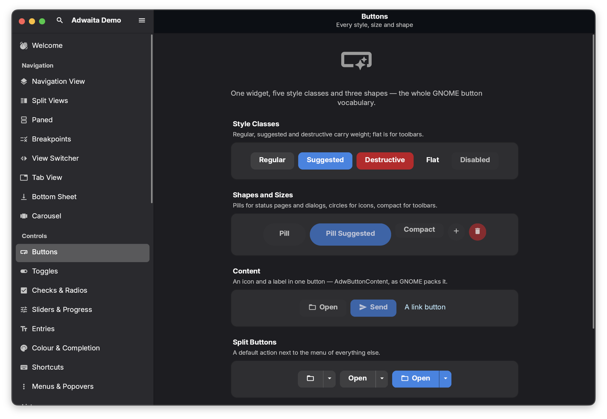
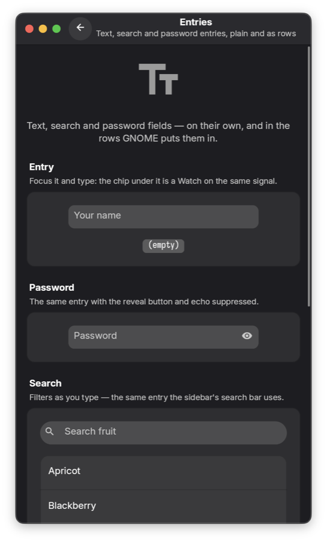
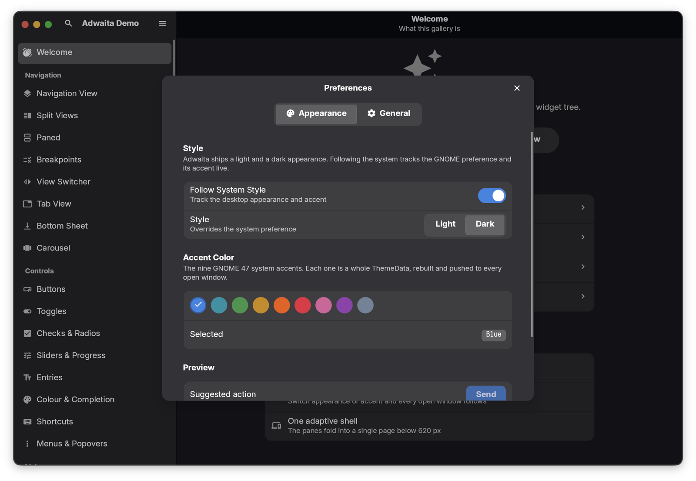

# Zigote.UI.Adwaita.Gallery

The reference app for [`Zigote.UI.Adwaita`](../Zigote.UI.Adwaita/README.md) — **37 pages**, one per
widget family, every one of them live. No screenshots, no mock rows: what you see is the widget doing
the thing.

```sh
dotnet run --project Zigote.UI.Adwaita.Gallery
```



---

## The shell

One window is an adaptive `AdwNavigationSplitView` under an `AdwToastOverlay`: a searchable,
sectioned `AdwSidebar` on the left, the selected page under a header bar that names it on the right.
Below **620 px** the two panes fold into a single navigable page and the content header grows a back
button — the same tree, no second layout.



Windows are peers. <kbd>⌘/Ctrl</kbd>+<kbd>N</kbd> opens another one with its own navigation, search
and toasts; shortcuts act on the window they were pressed in.

## Shortcuts

All use the platform command modifier — ⌘ on macOS, Ctrl elsewhere.

| Chord | Action |
| --- | --- |
| <kbd>Cmd</kbd>+<kbd>F</kbd> | Reveal the search bar and focus it |
| <kbd>Cmd</kbd>+<kbd>N</kbd> | New window |
| <kbd>Cmd</kbd>+<kbd>,</kbd> | Preferences |
| <kbd>Cmd</kbd>+<kbd>D</kbd> | Toggle dark (drops "follow system") |
| <kbd>Cmd</kbd>+<kbd>W</kbd> | Close window |
| <kbd>Cmd</kbd>+<kbd>Shift</kbd>+<kbd>/</kbd> | About |

## Pages

| Section | Pages |
| --- | --- |
| **Navigation** | Navigation View · Split Views · Paned · Breakpoints · View Switcher · Tab View · Bottom Sheet · Carousel · Image Grid |
| **Controls** | Buttons · Toggles · Checks & Radios · Sliders & Progress · Entries · Colour & Completion · Shortcuts · Menus & Popovers |
| **Lists** | Boxed Lists · Preferences · Large Lists (2 000 rows, recycled while you scroll) |
| **Feedback** | Banners · Toasts · Alert Dialogs · Spinner · Status Pages · Avatar |
| **Layout** | Clamp · Wrap Box · Adaptive |
| **Style** | Style Classes · Typography · Colors · Animations |
| **Zigote** | Reactivity · Concurrency · Drag and Drop |

The last section is the framework rather than the design system: signals and computed values driving
a live order total, background threads writing signals under a per-frame delivery budget, and
draggable payloads with drop targets.

## Appearance



The preferences dialog is an `AdwPreferencesDialog` over three signals — follow-system, dark, and one
of the nine GNOME accents. Each change rebuilds a `ThemeData` and pushes it to **every open window**,
which is the point of keeping the whole palette in one theme object. On GNOME, follow-system tracks
the desktop's appearance and accent live.

## Adding a page

[`GalleryRegistry`](GalleryRegistry.cs) is the single table of contents — the sidebar, the search
index, the header titles and the welcome page's cross-links are all derived from it. A new page is
one entry:

```csharp
new GalleryEntry("Widget Name", "One line under it in search",
                 MaterialIcons.SomeIcon, () => new MyPage()),
```

Pages return a `GalleryPage` — the shared scaffold that gives every one of them the same GNOME
preferences-page rhythm: a scrolling, clamped column under a dim hero icon, title and one-line
description. They are built once and kept, so leaving a page and coming back finds its animation,
carousel position and counters where they were left.

## Self-test

```sh
dotnet run --project Zigote.UI.Adwaita.Gallery -- --self-test
```

Headless, no window, exit code is the result. It constructs **every** page — which is what catches a
registry entry wired to a type that throws in its constructor — checks that the sidebar's row order
matches the index space the shell selects in, that titles are unique and round-trip through
`IndexOf`, and runs the concurrency page's own deterministic check on concurrent signal writes.
