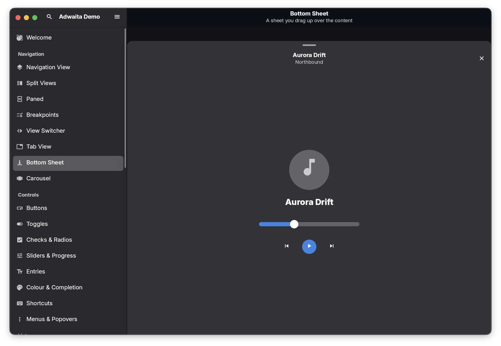

# Zigote.UI.Adwaita

The **GNOME Adwaita** design system, implemented on Zigote's widget kernel: 94 `Adw*` types, both appearances, the nine
system accents, the boxed-list row vocabulary, adaptive navigation, and client-side decorations the app draws itself.
Tokens and metrics track **libadwaita 1.10 (GNOME 51)** — every colour, radius and state fill here has a line of
`src/stylesheet/` behind it.

```csharp
new AdwaitaApp(new Shell(), title: "My App").Run();
```


> This is a **design system, not a GTK binding.** Nothing links against GTK, GLib or libadwaita — the
> widgets are Zigote widgets, laid out and painted by Zigote's own renderer. An Adwaita app therefore
> builds and runs unchanged on macOS and Windows; the screenshot above is macOS.

**See it all:** from the repo root, `dotnet run --project Zigote.UI.Adwaita.Gallery` — 37 pages, one per widget family
([gallery README](../Zigote.UI.Adwaita.Gallery/README.md)).

---

## Contents

- [The application shell](#the-application-shell)
- [Theming](#theming)
- [Chrome: header bars and window controls](#chrome-header-bars-and-window-controls)
- [Boxed lists and preferences](#boxed-lists-and-preferences)
- [Navigation](#navigation)
- [Adaptive layout](#adaptive-layout)
- [Feedback: toasts, banners, dialogs](#feedback-toasts-banners-dialogs)
- [A complete app](#a-complete-app)
- [Style, type and metrics](#style-type-and-metrics)
- [Differences from libadwaita](#differences-from-libadwaita)

---

## The application shell

`AdwaitaApp` is a `ZigoteApp` preconfigured for the Adwaita look. It resolves window chrome from the desktop it finds
itself on, sets the corner radius, registers the header bar as the drag band, and — unless you hand it an explicit
theme — follows the system appearance and accent for as long as it runs.

```csharp
public AdwaitaApp(
    Widget? home = null,
    string title = "Zigote App",
    ThemeData? theme = null,           // null → follow the system (light off GNOME)
    Dictionary<string, WidgetBuilder>? routes = null,
    string initialRoute = "/",
    RouteFactory? onGenerateRoute = null,
    List<Page>? pages = null,          // Navigator 2.0 declarative pages
    Func<Route, object?, bool>? onPopPage = null,
    bool followSystem = true)
```

| Member                             | What it gives you                                                                                                          |
|------------------------------------|----------------------------------------------------------------------------------------------------------------------------|
| `SystemAccent`                     | The desktop accent hue (GNOME 47+); `Blue` where unavailable.                                                              |
| `SystemPrefersDark`                | The desktop's dark-appearance preference.                                                                                  |
| `SystemStyleChanged`               | Fires once at startup and on every appearance/accent change, after `Theme` has been rebuilt. Rebuild retained chrome here. |
| `OpenWindow(content, title, w, h)` | Another OS window: same chrome, its own widget tree, re-themed live with the app.                                          |

Windows are peers — each can host its own navigation, search, shortcuts and toasts. The gallery opens as many as you
like and every one of them repaints when you change the accent.

## Theming

An Adwaita appearance is a whole `ThemeData`, built by `AdwTheme`:

```csharp
AdwTheme.Light                                  // the GNOME default
AdwTheme.Dark
AdwTheme.Create(AdwAccent.Purple, dark: true)   // cache the result — theme switching is by reference
```

`AdwAccent` is the GNOME set: `Blue`, `Teal`, `Green`, `Yellow`, `Orange`, `Red`, `Pink`, `Purple`,
`Slate`. Because an accent produces a complete theme rather than a late tint, switching one repaints every open window
in a frame. The *standalone* form of each hue — links, alert responses, menu check marks — is derived exactly as the
stylesheet derives it, `oklab(from @accent_bg_color min(l, 0.5) a
b)` in light and `max(l, 0.85)` in dark, so all nine (and the destructive/success/warning trio) land on libadwaita's
published values.

Tokens with no `ThemeData` slot live in `AdwPalette` — headerbar, sidebar, popover and thumbnail surfaces, dim labels,
the scrim, the status colours, and the **state fills**.
`AdwPalette.For(theme)` picks the light or dark set from whatever theme is in scope.

Adwaita 1.10 states every neutral fill as `color-mix(in srgb, currentColor N%, transparent)`, so one ladder serves both
appearances — only currentColor flips. `AdwPalette` resolves those percentages once per appearance, and `AdwStyle` picks
the right rung:

| Ladder                        | Rest / hover / active                 | Where                                                                            |
|-------------------------------|---------------------------------------|----------------------------------------------------------------------------------|
| `ButtonFill*`                 | 10 / 15 / 30 % (checked 30 / 35 / 40) | raised buttons, entries, spin buttons, window controls, toggle-group backgrounds |
| `HoverFill` … `SelectedFill*` | 0 / 7 / 16 %, selected 10 / 13 / 19   | flat buttons, menu items, sidebar rows, tabs                                     |
| `ViewHoverFill`               | 0 / 4 / 8 %                           | rows inside a list view                                                          |
| `CardHoverFill`               | 0 / 3 / 8 %                           | boxed-list rows, `.card.activatable`                                             |
| `TroughFill*`                 | 15 / 20 / 25 %                        | switch, scale, check and progress troughs                                        |

`AdwStyle.ButtonFill`, `RowFill`, `MenuRowFill`, `SidebarRowFill`, `ViewRowFill` and `TroughFill` are the entry points;
use them instead of reaching for a fill directly, so a control lands on the ladder its stylesheet counterpart uses.

**Following the desktop.** On GNOME, `GnomeDesktop` reads `color-scheme`, `accent-color` and
`button-layout`, and keeps them fresh with `gsettings monitor` — or, inside a Flatpak or Snap sandbox where the host's
dconf is unreachable, through the `org.freedesktop.portal.Settings` D-Bus interface, matching the portal's sRGB accent
triple back to the nearest named hue. Off GNOME it is a safe no-op with stock defaults.

## Chrome: header bars and window controls

An Adwaita header bar *is* the titlebar. `AdwaitaApp` therefore asks for client-side decorations wherever a desktop can
host them:

| Host                    | Result                                                                                                                                                                                     |
|-------------------------|--------------------------------------------------------------------------------------------------------------------------------------------------------------------------------------------|
| **GNOME**               | CSD. `AdwWindowControls` draws the libadwaita ✕/─/□ circles inside your header bars, honouring the system `button-layout` — which buttons exist, their order, and which side they sit on. |
| **macOS**               | CSD, with the traffic lights drawn in the bar and vertically centred as macOS centres them.                                                                                                |
| **Windows, KDE, other** | System decorations; Adwaita content inside them.                                                                                                                                           |

`WindowChrome.Preference` overrides the lot when you need to force a look for testing.

Under CSD the window frame follows the stylesheet down to the pixel: a 15px corner (`--window-radius`, squared while
maximized), a 1px `rgb(255 255 255 / 7%)` outline just inside the edge (`App.CsdOutlineColor`, without which a dark
window bleeds into a dark desktop), a **46px**
titlebar rather than the 47px of an inline header bar — the missing pixel is the outline's —
`6px 7px 7px 7px` of bar padding, and frame buttons whose 24px circles sit in 34px hit targets 3px apart, exactly as
`windowcontrols > button { min-width: 24px; padding: 5px }` lays them out. The drag band matches the bar's own height,
so the first row of content takes clicks instead of moving the window.

```csharp
new AdwToolbarView(content) {
    TopBars = {
        new AdwHeaderBar {
            TitleWidget = new AdwWindowTitle("Inbox", "3 unread"),
            Start = { new AdwButton { IconName = Icons.MoreVert, Style = AdwButtonStyle.Flat } },
            End   = { new AdwMenuButton() },
        },
    },
    BottomBars = { new AdwViewSwitcherBar(stack) },
}
```

`AdwToolbarView` is the standard container: bars above, bars below, content between, with the raised/flat handling
libadwaita does. `AdwWindowControls` renders nothing when the window has no CSD or when the layout puts no buttons on
its side, so it is always safe to mount.

## Boxed lists and preferences

The row vocabulary every GNOME app is built from:

```csharp
new AdwPreferencesGroup("Account", "Signed in as you@example.com") {
    Rows = {
        new AdwActionRow("Profile", "Name, avatar and bio") { ShowChevron = true,
                                                              OnActivated = OpenProfile },
        new AdwSwitchRow("Sync", "Keep this device up to date", value: true, on => Sync(on)),
        new AdwComboRow("Quality", options, selectedIndex: 1),
        new AdwSpinRow("Cache", min: 1, max: 64),
        new AdwEntryRow("Display name"),
        new AdwPasswordEntryRow("Password"),
        new AdwExpanderRow("Advanced") { Rows = { … } },
        new AdwButtonRow("Sign Out") { Destructive = true },
    },
}
```

Groups stack into an `AdwPreferencesPage`, and pages into an `AdwPreferencesDialog` — the adaptive settings window with
its own view switcher, exactly as GNOME presents it.

Every row is activatable, focusable and semantics-described; a disabled row dims as a whole and stops activating, as
Adwaita does.

## Navigation

| Widget                                        | Shape                                                                                                                          |
|-----------------------------------------------|--------------------------------------------------------------------------------------------------------------------------------|
| `AdwNavigationView`                           | A page stack. `Push`/`Pop`, `Depth`, and (with `AutoHeaderBar`) a header that follows the stack and grows its own back button. |
| `AdwNavigationSplitView`                      | Sidebar + content, folding into a single navigable page below a breakpoint.                                                    |
| `AdwOverlaySplitView`                         | Sidebar that becomes an overlay instead of a column.                                                                           |
| `AdwViewStack` + `AdwViewSwitcher`            | One stack, three presentations: header switcher, `AdwViewSwitcherBar` at the bottom, `AdwViewSwitcherSidebar` at the side.     |
| `AdwTabView` / `AdwTabBar` / `AdwTabOverview` | Pinned and closable tabs with a tab menu and a grid overview.                                                                  |
| `AdwCarousel`                                 | Swipeable pages with dot or line indicators.                                                                                   |
| `AdwSidebar`                                  | The searchable, sectioned sidebar the gallery uses; `Filter` re-filters rows in place.                                         |
| `AdwPaned`                                    | Two panes and a draggable handle.                                                                                              |

## Adaptive layout

```csharp
new AdwNavigationSplitView { Sidebar = list, Content = detail, AutoCollapseBelow = 620f }
```

For anything more conditional than a fold, `AdwBreakpointBin` evaluates conditions against its own size and swaps child,
or runs `Apply`/`Unapply` callbacks:

```csharp
new AdwBreakpointBin(wideLayout) {
    Breakpoints = {
        new AdwBreakpoint(AdwBreakpointCondition.MaxWidth(500)) { Child = narrowLayout },
    },
}
```

Conditions compose: `MinWidth`, `MaxWidth`, `MinHeight`, `MaxHeight`, `MinAspectRatio`,
`MaxAspectRatio`, combined with `.And(…)` / `.Or(…)`. Breakpoints are declared narrowest-first and the last match wins.

`AdwMultiLayoutView` goes further — name slots once, and let each layout place them differently.
`AdwClamp` keeps content at a readable width in a wide window; `AdwWrapBox` flows children onto new lines.

## Feedback: toasts, banners, dialogs

```csharp
var toasts = new AdwToastOverlay(content);          // mount once, near the root
toasts.AddToast(new AdwToast("File deleted") { ButtonLabel = "Undo",
                                               OnButtonClicked = Undo,
                                               Timeout = 5f });
```

- `AdwBanner` — the inline bar for something that needs an answer.
- `AdwAlertDialog` — adaptive alerts with suggested and destructive responses.
- `AdwDialog` / `AdwDialog.Show(child)` — the generic adaptive dialog, dismissable, size-constrained.
- `AdwAboutDialog`, `AdwShortcutsDialog` (with `AdwShortcutLabel` key caps).
- `AdwStatusPage` — empty, error and welcome states; `Compact` for embedding in a pane.
- `AdwBottomSheet` — a sheet dragged up over the content.
- `AdwSpinner` — the indeterminate Adwaita spinner.



## A complete app

This compiles as written — an app, a header bar, a boxed list, and one signal on screen:

```csharp
using Zigote.Core.State;
using Zigote.UI.Adwaita;
using Zigote.UI.Widgets;
using Zigote.UI.Widgets.Controls;

new AdwaitaApp(new CounterPage(), title: "Counter").Run();

sealed class CounterPage : ComposedWidget
{
    private readonly Signal<int> _count = new(0);
    private readonly Signal<bool> _big = new(false);

    protected override Widget Build(BuildContext context) =>
        new AdwToolbarView(
            new AdwClamp(
                new AdwPreferencesGroup("Counter", "One signal, two rows and a header") {
                    Rows = {
                        new AdwActionRow("Count", "Activate the row to increment") {
                            OnActivated = () => _count.Value += _big.Value ? 10 : 1,
                            Suffixes    = { new Watch(() => new Label($"{_count.Value}")) },
                            ShowChevron = true,
                        },
                        new AdwSwitchRow("Big steps", "Add ten at a time", false,
                                         on => _big.Value = on),
                    },
                })) {
            TopBars = {
                new AdwHeaderBar {
                    TitleWidget = new Watch(() =>
                        new AdwWindowTitle("Counter", $"{_count.Value} so far")),
                },
            },
        };
}
```

## Style, type and metrics

| Type             | Holds                                                                                                                                                                                                                                                                      |
|------------------|----------------------------------------------------------------------------------------------------------------------------------------------------------------------------------------------------------------------------------------------------------------------------|
| `AdwTypography`  | The libadwaita type scale (`.title-1` 181 % … `.caption` 82 % of the 11pt document font, 140 % line height on the body classes): `Title1`…`Title4`, `Heading`, `Body`, `CaptionHeading`, `Caption`, `Monospace`. Use these inside Adwaita widgets instead of `Typography`. |
| `AdwMetrics`     | Every constant the kit lays out with — control radius 9, card 12, popover/dialog/window 15, alert 18, check 6; button height 34 (28 compact, 44 pill), header bar 47 (46 as a titlebar), row minimum 50 (36 sidebar, 40 button row, 32 menu), sidebar 260, clamp 600.      |
| `AdwStyle`       | State → colour resolution: `ButtonFill`, `ButtonForeground`, the five row ladders, `TroughFill`, `SliderKnob`, the disabled/dim opacities, and the ~100 ms fill transitions every button-like control fades with.                                                          |
| `AdwButtonStyle` | `Regular`, `Suggested`, `Destructive`, `Flat`, `Opaque` — plus `Pill`, `Circular` and `Compact` as shape flags on `AdwButton`.                                                                                                                                             |
| `AdwPalette`     | The tokens with no `ThemeData` slot, plus `Fill(theme, percent)` / `Mix` for one-off `color-mix` values.                                                                                                                                                                   |

## Differences from libadwaita

Stated up front so nothing surprises you:

- **Names, not ABI.** The API mirrors libadwaita so the GNOME HIG and its documentation transfer, but this is not
  API-compatible with the C library, and not every libadwaita widget exists.
- **Bundled type and icons.** Text renders in **Inter**, icons come from the bundled **Material Icons** font. Adwaita
  Sans / Cantarell and the system icon theme are not read.
- **`button-layout` is honoured; the compositor's full gesture policy is not.** Window-manager behaviours beyond the
  framework's own drag and double-click handling are outside this kit.
- **GTK settings beyond appearance, accent and button layout are not consulted** — font scaling, cursor themes and
  animation preferences follow Zigote's own settings.
- **Two colours are held deliberately off-spec, for this renderer.** The renderer composites in linear space, so
  translucent values land lighter than CSS means them to; `AdwPalette` solves for the alpha that reproduces the
  stylesheet's result, but the light-mode foreground is carried at
  `alpha(#000006, .85)` against the stylesheet's `.8`, and `DimLabel` at `.65` against `.55`. At the authored values the
  12px captions this UI leans on sit at the AA floor or under it.
- **Shadows are one soft layer each, not three.** `%card`, `popover > contents` and the window frame each stack three
  shadows in CSS; `AdwMetrics.CardShadow` / `PopoverShadow` collapse them to the single layer this renderer paints, with
  the hairline ring drawn separately as a border.
- **Gradients are flattened.** An `AdwAvatar` uses libadwaita's fourteen avatar colours but fills with the gradient's
  darker tone instead of interpolating between the two.
- **High-contrast and backdrop variants are not implemented.** The stylesheet's
  `prefers-contrast: more` block and its `:backdrop` fades have no counterpart here.
- Properties on `ComposedWidget`-derived widgets use `AdwStyle.Set(ref field, value)`, which invalidates on real change.
  A plain auto-property would silently do nothing after the first build, because the `Build` result is retained.

---

## Dependencies

`Zigote.UI` (the kernel), `Zigote.UI.Material` (icon constants and shared controls) and
`Zigote.UI.BottomSheet`. Internals that are pure logic — accelerator parsing, layout maths — are unit-tested directly
from `Zigote.Tests` rather than pushed into the public surface: this kit mirrors libadwaita's API and should not grow
extras.

## Related

- [`../Zigote.UI.Adwaita.Gallery`](../Zigote.UI.Adwaita.Gallery/README.md) — the 37-page gallery.
- [`../docs/migration/`](../docs/migration/README.md) — retained mode, and per-framework guides.
- [`../docs/architecture.md`](../docs/architecture.md) — how the kernel underneath works.
